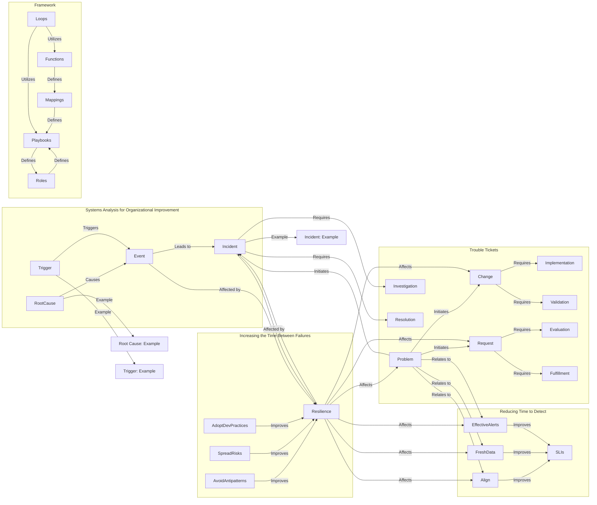

# Systems Analysis and Framework: A Comprehensive Overview

In this guide, we will explore the interconnected elements of systems analysis for organizational improvement, focusing on the relationship between root causes, triggers, events, incidents, and their impact on the overall framework. Additionally, we will examine the connections between trouble tickets, the framework, and strategies for reducing time to detect and increasing the time between failures.

## Systems Analysis for Organizational Improvement

The system's analysis for organizational improvement involves understanding the relationships between root causes, triggers, events, and incidents. It establishes a framework for addressing issues and enhancing organizational resilience.

### Root Causes, Triggers, and Incidents

- **RootCause and Trigger Relationship:** Root causes and triggers contribute to the occurrence of events, which, in turn, lead to incidents.
  - **Example Root Cause and Trigger:** Illustrated through specific examples (RootCauseExample and TriggerExample).

### Increasing the Time Between Failures

To enhance organizational resilience, strategies are employed to increase the time between failures, focusing on avoiding antipatterns, spreading risks, and adopting development practices.

- **Avoiding Antipatterns:** Identify and avoid patterns that contribute to failures.
- **Spreading Risks:** Distribute risks across various components to minimize their impact.
- **Adopting Dev Practices:** Implement development practices that enhance system resilience.

## Trouble Tickets and Framework

The trouble ticket system is a vital component that connects problems, changes, incidents, and requests. Simultaneously, the overall framework incorporates loops, functions, playbooks, roles, and mappings.

### Trouble Tickets

Trouble tickets act as a central point for managing various processes:
- **Problem Initiation:** Initiates changes, incidents, and requests.
- **Change Requirements:** Requires implementation and validation.
- **Incident Requirements:** Requires investigation and resolution.
- **Request Requirements:** Requires evaluation and fulfillment.

### Framework Components

The framework encompasses the following key components:
- **Loops and Functions:** Utilized within the framework to define iterative processes and specific functionalities.
- **Mappings and Playbooks:** Define relationships and structured workflows for addressing problems and implementing changes.
- **Roles:** Play a role in orchestrating tasks within the defined playbooks.

## Strategies for Reducing Time to Detect

Efforts to reduce the time to detect incidents involve aligning with service level indicators (SLIs), ensuring access to fresh data, and implementing effective alerting mechanisms.

- **Aligning with SLIs:** Align system performance with predefined service level indicators.
- **Fresh Data Access:** Ensuring access to real-time and up-to-date data for accurate detection.
- **Effective Alerts:** Implementing alerting mechanisms that efficiently notify relevant stakeholders.

### Relationships and Impact

- **Problem Relationship:** Problems relate to strategies for reducing time to detect (Align, FreshData, EffectiveAlerts).
- **Resilience Impact:** Resilience affects changes, incidents, requests, problems, and strategies for reducing time to detect.

Understanding these interconnected elements empowers users to analyze and improve organizational processes, manage incidents effectively, and implement strategies for enhanced system resilience.

