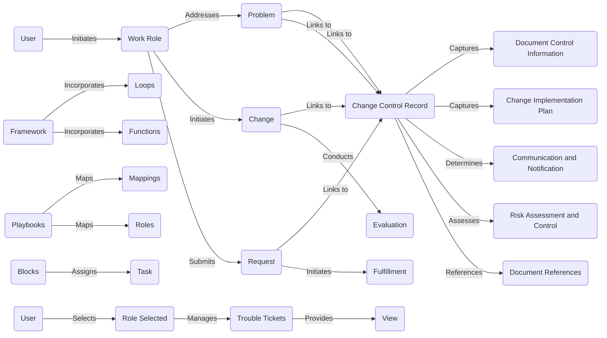

# Understanding the components: A User's Guide

## User Initiation and Work Roles

The system begins with you, the user, who initiates various work roles. These roles play a crucial part in addressing problems, initiating changes, and submitting requests. Work roles act as the foundation for the entire process, ensuring that tasks are organized and carried out seamlessly.

## Problem Resolution and Change Initiation

When faced with a problem, the associated work role addresses it by linking to a Change Control Record. Simultaneously, users can initiate changes by submitting requests, thereby triggering the change process.

## Change Control Record

The Change Control Record is a pivotal element that captures essential information. It links to the problem, change, and request, providing a comprehensive overview of the entire process. This record plays a key role in documenting control information, change implementation plans, communication and notification details, risk assessments, and references to relevant documents.

## Evaluation and Fulfillment

Once a change is initiated, an evaluation is conducted to assess its impact and effectiveness. Simultaneously, the fulfillment process is initiated to carry out the requested changes. This ensures a thorough and well-executed transition.

## Framework and Components

The system is built upon a robust framework that incorporates loops, functions, playbooks, mappings, roles, and tasks. This interconnected framework ensures that each component collaborates seamlessly to achieve the desired outcomes.

- **Loops and Functions:** The framework incorporates loops and functions, allowing for iterative processes and specialized functionalities.

- **Playbooks and Mappings:** Playbooks map out processes, and mappings define relationships between playbooks, roles, and tasks. This helps in creating a structured and efficient workflow.

- **Roles and Tasks:** Various roles are assigned specific tasks within blocks, ensuring a distributed and collaborative approach to problem-solving and change implementation.

## User Engagement and Troubleshooting

Users play a vital role in the system by selecting roles and managing trouble tickets. The system allows users to view the entire process, providing transparency and accountability.

