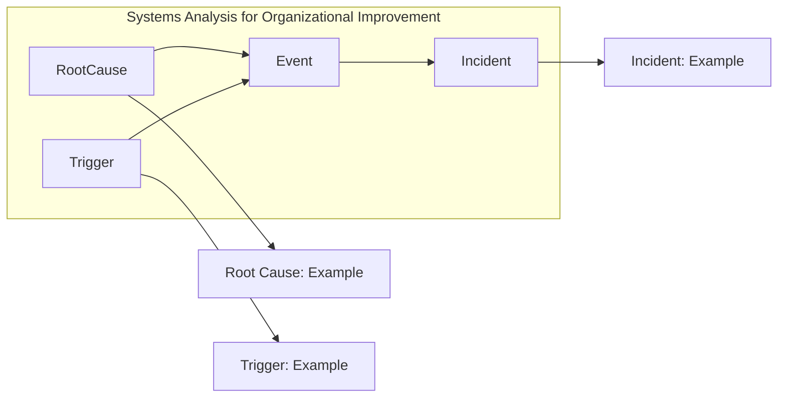

# Systems Analysis for Organizational Improvement: A Brief Overview

In systems analysis for organizational improvement, we focus on understanding the relationships between root causes, triggers, events, and incidents.

- **Root Cause and Trigger Relationship:** Root causes and triggers contribute to the occurrence of events.
  - **Example Illustration:**
    - **Root Cause Example:** Demonstrates a specific instance of a root cause.
    - **Trigger Example:** Highlights a specific example of a trigger.

- **Event and Incident Connection:** Events lead to incidents, representing the impact of identified issues.

This analysis framework aids in identifying and addressing issues within the organizational system, promoting continuous improvement and incident management.

