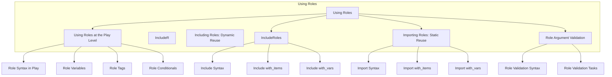

# Understanding Roles in the System

We will explore the intricacies of using roles within the system, focusing on play-level roles, dynamic reuse through including roles, static reuse via importing roles, and role argument validation.

## Using Roles at the Play Level

Roles play a pivotal role in orchestrating tasks at the play level. Understanding their syntax, variables, tags, and conditionals is crucial for effective utilization.

### Play-Level Roles

- **Role Syntax in Play:** Define roles within plays using a specific syntax that ensures clarity and consistency in execution.

- **Role Variables:** Utilize variables within roles at the play level to customize and parameterize their behavior.

- **Role Tags:** Apply tags to roles to categorize and organize them efficiently.

- **Role Conditionals:** Implement conditionals within roles to enable dynamic execution based on specific criteria.

## Dynamic Reuse: Including Roles

Roles can be dynamically reused through the process of including them within plays. This promotes modularity and efficient code organization.

### Including Roles: Dynamic Reuse

- **Include Syntax:** Specify the syntax for including roles in plays.

- **Include with_items:** Dynamically include roles with specific items, allowing for iterative processes.

- **Include with_vars:** Include roles with defined variables to customize their behavior dynamically.

## Static Reuse: Importing Roles

Static reuse of roles involves importing them into plays. This enhances code maintainability and promotes a structured approach to role utilization.

### Importing Roles: Static Reuse

- **Import Syntax:** Define the syntax for importing roles into plays.

- **Import with_items:** Import roles with specific items, facilitating controlled execution.

- **Import with_vars:** Import roles with predefined variables for tailored behavior.

## Role Argument Validation

Ensuring the validity of role arguments is crucial for preventing errors and ensuring smooth execution. The system provides tools for validating role arguments effectively.

### Role Argument Validation

- **Role Validation Syntax:** Specify the syntax for validating role arguments.

- **Role Validation Tasks:** Define specific tasks for role argument validation, ensuring that inputs meet the required criteria.

