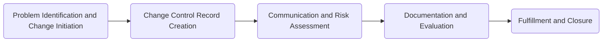
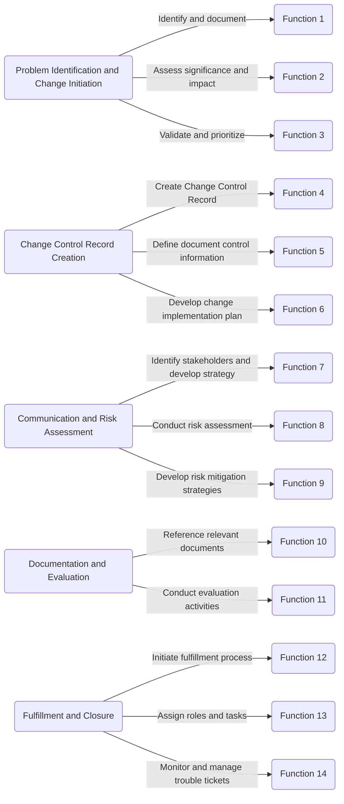

# Navigating Playbooks and Functions in the System

In this guide, we will delve into the system's playbooks and functions, exploring the workflow for addressing problems, managing changes, and executing various functions.

## Playbooks: Workflow for Change Management

The system employs playbooks to guide users through a structured workflow for effective change management. The process unfolds in a series of steps, each dedicated to a specific aspect of change initiation, communication, risk assessment, documentation, and fulfillment.

### Workflow Overview

1. **Problem Identification and Change Initiation (B1):**
   - **Identify and document (F1):** Capture and document the identified problem.
   - **Assess significance and impact (F2):** Evaluate the importance and potential consequences of the identified problem.
   - **Validate and prioritize (F3):** Validate the problem's authenticity and prioritize it based on urgency.

2. **Change Control Record Creation (B2):**
   - **Create Change Control Record (F4):** Generate a comprehensive record to track changes.
   - **Define document control information (F5):** Specify information related to document control.
   - **Develop change implementation plan (F6):** Formulate a plan for implementing the proposed changes.

3. **Communication and Risk Assessment (B3):**
   - **Identify stakeholders and develop strategy (F7):** Recognize key stakeholders and create a communication strategy.
   - **Conduct risk assessment (F8):** Evaluate potential risks associated with the proposed changes.
   - **Develop risk mitigation strategies (F9):** Formulate strategies to mitigate identified risks.

4. **Documentation and Evaluation (B4):**
   - **Reference relevant documents (F10):** Include references to documents pertinent to the changes.
   - **Conduct evaluation activities (F11):** Assess the impact and effectiveness of the implemented changes.

5. **Fulfillment and Closure (B5):**
   - **Initiate fulfillment process (F12):** Begin the process of fulfilling the requested changes.
   - **Assign roles and tasks (F13):** Distribute roles and tasks efficiently for collaborative execution.
   - **Monitor and manage trouble tickets (F14):** Keep track of and manage trouble tickets throughout the fulfillment process.

## Functions: Execution of Key Tasks

Functions play a vital role in executing specific tasks within the system. Each function corresponds to a step in the playbook, contributing to the overall success of change management.

### Key Functions

- **Functions 1-3:** Focus on problem identification, significance assessment, and prioritization.
- **Functions 4-6:** Involve the creation of the Change Control Record and planning for change implementation.
- **Functions 7-9:** Address communication, stakeholder identification, risk assessment, and mitigation strategies.
- **Functions 10-11:** Deal with documentation by referencing relevant documents and conducting evaluations.
- **Functions 12-14:** Handle the fulfillment and closure phase, including initiating the fulfillment process, assigning roles and tasks, and managing trouble tickets.

By understanding and following the structured workflows presented in playbooks and executing specific tasks through functions, users can effectively manage changes and address problems within the system.

# Functions

